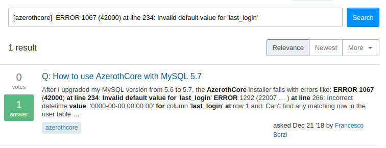
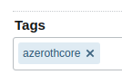

# 如何寻求帮助
---

## 需要帮助？
---

你需要 AzerothCore 的支持吗？不用担心，我们很乐意为您提供帮助！

无论您是在安装艾泽拉斯核心时遇到问题，还是想咨询如何操作或一般帮助问题，**我们都会帮助您**。

我们只希望您以**正确的方式**寻求帮助。在寻求帮助之前，请先阅读本文档。

## 常见问题和常见错误
---

首先，我们建议您阅读[常见问题](/faq)和[常见错误](/common-errors)，以便找到问题的解决方案。

## 为什么"正确的方法"如此重要？
---

如果您直接在聊天中提问，问题很容易丢失，而且您可能永远也得不到帮助，除非当时有人在线，能够帮助您。

如果您将问题放在 StackOverflow 上，问题就会一直**留**在那里，随时都会有人帮助您。您还可以在聊天中链接您的问题，以提高其可见度。还不明白吗？请继续阅读。

此外，用户提出的大多数问题都是重复性的。因此，我们需要一种高效的方式来处理所有支持请求。我们使用 StackOverflow 来处理支持问题，使用 GitHub 来处理错误报告。

听起来很复杂？一点也不复杂！**请继续阅读**。

## Bug 报告

某个游戏功能（如咒语/任务/天赋等）无法正常工作？

恭喜您！您刚刚发现了一个 bug，请在现有问题中搜索。很有可能已经有人报告了与您发现的相同的 bug，在这种情况下，我们恳请您留下评论以"确认"该错误。

示例：

如果在搜索现有的问题报告后没有找到，那么您应该[打开一个新问题](https://github.com/azerothcore/azerothcore-wotlk/issues/new)。

## 其他支持请求

- 安装 AzerothCore 时出现错误？
- 文档中是否有您不清楚的地方？
- 您想知道如何使用 AzerothCore 进行特定操作？
- 您是否正在尝试实现一个新功能、修复一个错误......？
- 您是否有与 AzerothCore 或其他 AzerothCore 自定义模块相关的 C++ 或 SQL 代码方面的问题？

此类问题被视为支持问题，通过 [StackOverflow](https://stackoverflow.com/questions/tagged/azerothcore) 进行处理。请阅读下文。

### 我需要在 StackOverflow 注册吗？

不一定！如果您有 GitHub、Google 或 Facebook 账户，您已经可以登录 [StackOverflow](https://stackoverflow.com/questions/tagged/azerothcore)（点击网站右上角的登录按钮）。

### 在现有问题中搜索

您的问题很有可能已经被别人问过了，所以请在 StackOverflow 上搜索。

例如，mysql 是否出错？请在 `[azerothcore]` 标签下搜索！

哦，已经有一个问题了！而且已经有了答案！让我们打开它！

### 如何提出新问题

如果找不到与我的具体问题相关的问题怎么办？让我们[打开一个新问题](https://stackoverflow.com/questions/ask?tags=azerothcore)。

请记住：
- 添加描述性信息。
    - 不好的例子：`我的数据库出错了，请帮帮我（I got DB error plz help me）`。
    - 好例子：`导入 sql 更新后，我得到了错误 "XXX"（After importing the sql updates, I get the error "XXX"）`。
- 不要忘记 `[azerothcore]` 标签！
    - 
- 根据您问题的类别（如 `c++`、`cmake`、`docker`、`mysql`、`sql` 等......）再**添加 4 个标签**也很有用。
- 将您的问题链接到我们 [Discord 聊天室](https://discordapp.com/invite/gkt4y2x)的 #support-general 频道
- 阅读：[stackoverflow.com/help/how-to-ask](https://stackoverflow.com/help/how-to-ask)
- 请**勿**将任何错误或代码以**图片**形式显示，而应以**文本**形式显示
- 尽可能多地添加链接、示例和细节。使您的问题具有**技术性**。

请努力正确格式化您的问题，否则问题将被关闭。

### 分享您的知识！

您有什么要与社区分享的吗？您觉得某些信息对别人（或您自己将来）有用吗？您是否解决了一个花了很长时间才弄明白的问题？

在 StackOverflow 上提出问题，然后自己回答！允许这样做吗？允许！请阅读以下内容：

https://stackoverflow.com/help/self-answer

### 示例

良好提问的问题示例：

- https://stackoverflow.com/questions/54171055/azerothcore-how-to-change-the-time-after-which-client-is-disconnected-when-bein
- https://stackoverflow.com/questions/67349437/azerothcore-change-race-or-faction-could-not-change-race-for-character
- https://stackoverflow.com/questions/71086118/configloadfile-found-incorrect-option-my-conf-in-config-file
- https://stackoverflow.com/questions/54699039/file-usr-include-linux-limits-h-has-been-modified-since-the-precompiled-header
- https://stackoverflow.com/questions/53884965/how-to-use-azerothcore-with-mysql-5-7
- https://stackoverflow.com/questions/57617534/azerothcore-change-the-port-of-authserver
- https://stackoverflow.com/questions/53919208/cmake-on-macos-error-could-not-find-mysql-headers
- https://stackoverflow.com/questions/66932154/how-to-lock-a-realm-for-gm-only
- https://stackoverflow.com/questions/68328919/how-to-change-the-clang-verion-when-compiling-azerothcore-with-dashboard-setup
- https://stackoverflow.com/questions/54206799/how-to-run-and-debug-azerothcore-using-clion
- https://stackoverflow.com/questions/54206649/clion-error-when-opening-an-azerothcore-project
- https://stackoverflow.com/questions/56347054/aborted-connection-10-to-db-acore-auth-user-root-host-172-18-0-3-got-a
- https://stackoverflow.com/questions/54504153/clang-with-clion-cannot-get-compiler-information
- https://stackoverflow.com/questions/56677483/use-typescripttolua-with-azerothcore-and-eluna-lua-engine
- https://stackoverflow.com/questions/64948325/undefined-symbols-for-architecture-x86-64-when-writing-unit-tests-with-gtest-and
- https://stackoverflow.com/questions/66723604/get-all-accounts-linked-to-a-certain-account-via-ip

> [英文链接](https://www.azerothcore.org/wiki/how-to-ask-for-help)
