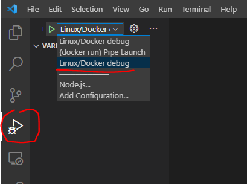
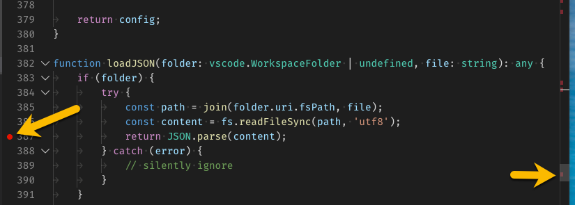
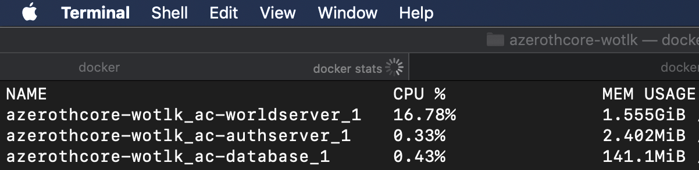
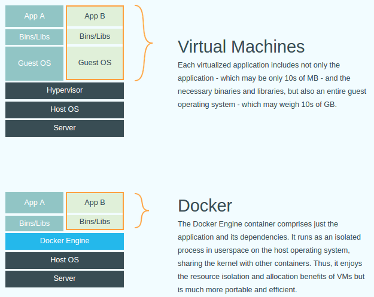
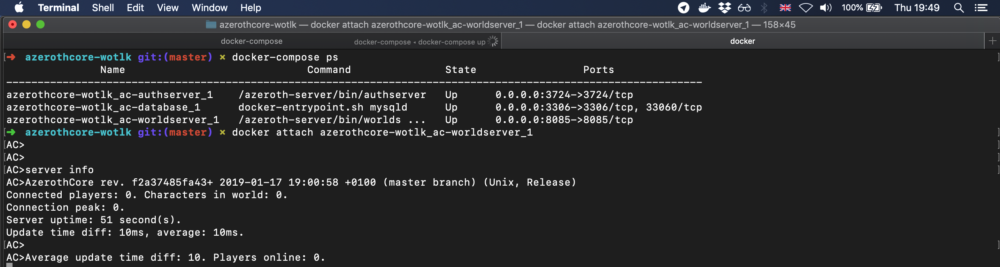
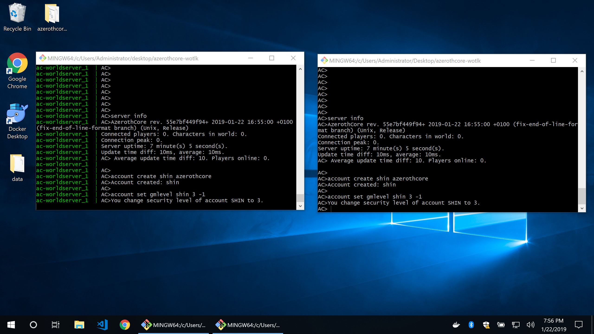

# 使用 Docker 安装
---

欢迎阅读 AzerothCore Docker 指南！

## 介绍
---

使用 Docker 安装 AzerothCore 是一个简化的过程，它有几个好处：

- 非常简单！Docker 会为你完成所有脏活累活。
- 可在所有支持 Docker 的操作系统（包括 **Windows**、**GNU/Linux** 和 **macOS**）上运行。
- 不需要安装很多依赖项（忘掉 *visual studio*、*cmake*、*mysql* 等，它们都不是必需的）
- 忘掉特定平台的 bug。使用 Docker 时，AzerothCore 将始终以 **Linux 模式** 运行。
- 还有许多[使用 Docker 其他好处](https://www.baidu.com/s?wd=docker%E7%9A%84%E4%BC%98%E5%8A%BF)

## 设置
---

### 软件要求

唯一要求是 [git](https://git-scm.com/download/) 和 Docker。

**新操作系统 [推荐]：**

- 为 GNU/Linux 安装 [Docker](https://docs.docker.com/install/linux/docker-ce/ubuntu)
- 为 macOS 10.12+ Sierra 及更新版本安装 [Docker Desktop for Mac](https://hub.docker.com/editions/community/docker-ce-desktop-mac)
- 为 Windows 10 安装 [Docker Desktop for Windows](https://hub.docker.com/editions/community/docker-ce-desktop-windows)

**旧版操作系统 [未测试]：**

- 对于 10.11 El Capitan 及以上版本的 macOS，安装 [Docker Toolbox for Mac](https://docs.docker.com/toolbox/toolbox_install_mac/)
- 对于 Windows 7/8/8.1 安装 [Docker Toolbox for Windows](https://docs.docker.com/toolbox/toolbox_install_windows/)

在进一步操作之前，请在终端中键入以下信息，确保系统中已安装 `docker` 和 `docker compose`：

```bash
docker --version
```

```bash
docker compose version
```

你应该会看到类似的输出结果：

```bash
Docker version 20.10.5, build 55c4c88
Docker Compose version 2.10.2
```

**Windows 用户请注意**：你可以使用 **git-bash**（git 附带的 shell）作为终端。

## 克隆 AzerothCore 仓库

你需要克隆 AzerothCore 仓库（或使用自己的分支）：

```bash
git clone https://github.com/azerothcore/azerothcore-wotlk.git
```

现在使用 `cd azerothcore-wotlk` 进入主目录。**所有命令都必须在此文件夹内运行**。

## 安装

在你的终端（如果使用 Windows，请使用 git bash）中，在 azerothcore-wotlk 文件夹中运行以下命令

**重要**：以下程序使用的是我们的 acore.sh dashboard，但这些命令是 docker compose 命令的快捷方式。你可以运行 `./acore.sh docker --help` 查看后台使用的 `docker compose` 命令，并阅读每条命令的说明

1. 编译 AzerothCore：

```bash
./acore.sh docker build
```

它会自动构建 docker 镜像并编译核心！这可能需要一段时间。与此同时，你可以去喝杯酒了:wine_glass:

**开发人员注意**：如果你正在处理代码，需要快速编译二进制文件，上面的命令对你来说可能有点多余，因为你可能不需要重建镜像。因此，我们建议使用以下解决方案之一：

- `./acore.sh docker dev:build` 它只构建开发镜像并编译源代码。

2. 下载客户数据：

```bash
./acore.sh docker client-data
```

**重要**： 该命令只能在首次安装和有新版本客户端数据时执行

3. 运行容器

```bash
./acore.sh docker start:app
```

**恭喜！你现在你已经拥有一个正常运行的 azerothcore 服务器！继续下一步，创建一个账户。**

如果需要在后台运行，可以使用下面的命令运行 docker compose 独立模式：

```bash
./acore.sh docker start:app:d
```

4. 访问 worldserver 控制台

打开一个新终端，运行以下命令

```bash
docker compose ps
```

查找 worldserver 名称

```bash
azerothcore-wotlk_ac-authserver_1    ./acore.sh run-authserver     Up             0.0.0.0:3724->3724/tcp,:::3724->3724/tcp
azerothcore-wotlk_ac-database_1      docker-entrypoint.sh mysqld   Up (healthy)   0.0.0.0:3306->3306/tcp,:::3306->3306/tcp, 33060/tcp
azerothcore-wotlk_ac-worldserver_1   ./acore.sh run-worldserver    Up             0.0.0.0:7878->7878/tcp,:::7878->7878/tcp, 0.0.0.0:8085->8085/tcp,:::8085->8085/tcp
```

然后附加世界服务器。例如：

```bash
docker attach azerothcore-wotlk_ac-worldserver_1
```

如果收到错误信息，`the input device is not a TTY. If you are using mintty, try prefixing the command with 'winpty'`。

这条命令会自动将你的终端连接到世界服务器控制台。现在你可以运行 `account create <user> <password>` 来[创建你的第一个游戏账户](/creating-accounts)。

**重要**：**若要分离**：按 `ctr+p` 和 `ctrl+q`。切勿尝试按 `ctrl+c` 分离，否则会杀死你的 worldserver 进程！

5. 访问数据库并更新 realmlist

要访问 MySQL 数据库，我们推荐使用 [HeidiSQL](https://www.heidisql.com/)（Windows/Linux+Wine）或 [SequelPro](https://www.sequelpro.com/)（macOS）等客户端。使用 `root` 作为用户，`127.0.0.1` 作为默认主机。数据库 `root` 用户的默认密码为 `password`。

除非你的服务器与客户端安装在同一网络上，否则你可能需要用服务器的公共 IP 地址更新 `acore_auth` 数据库中的 `realmlist` 地址：

```bash
USE acore_auth;
SELECT * FROM realmlist;
UPDATE realmlist SET address='<SERVER PUBLIC IP ADDRESS>';
```

### 如何让你的 AzerothCore 保持最新

首先，你只需使用 git 工具运行以下常用命令更新你的版本库：

`git pull origin master`：这将从 azerothcore 仓库下载最新提交的内容。

然后运行以下命令即可：

`./acore.sh docker build`：重建镜像并生成新的二进制文件。

注意：我们并不经常更新客户端数据，但在更新时，你可以运行以下命令：

`./acore.sh docker client-data`：如果有新版本的客户端数据，它会下载新版本的客户端数据。

### 如何使用 GDB 运行 worldserver

使用 GDB 运行服务器可以在服务器崩溃时生成 crashdump。crashdump 文件有助于开发人员了解哪些行出现了问题，并在可能的情况下进行修复。

**请记住，你应该使用以下编译类型之一编译代码：Debug 或 RelWithDebInfo，否则 GDB 将无法正常工作。**

启用 GDB 的步骤如下：

1. 在 `azerothcore-wotlk` 软件源的 `/conf/` 目录下创建 `config.sh` 文件
2. 在文件中添加以下配置 `AC_RESTARTER_WITHGDB=true`。这将配置我们的 docker 服务使用的重启器，使其使用 GDB 而不是直接使用二进制文件
3. 重启容器，就这样！

如果服务器崩溃，你可以在 `/env/docker` 文件夹中找到 crashdump 文件 (`gdb.txt`)

### 如何使用 dev-container

在我们的 docker compose 中，你可以找到 `ac-dev-server` 服务。该服务用于我们的构建和数据库操作，但你也可以用它来使用 [VSCode Remote Docker 扩展](https://code.visualstudio.com/docs/remote/containers)进行开发。

dev-container 可让你将 Docker 容器用作全功能的开发环境。我们项目中的 `.devcontainer` 文件夹包含一些文件，用于告诉 VS Code 如何访问（或创建）一个包含所有所需工具的开发容器。该容器将运行附带所有软件和配置的艾泽拉斯核心，以便使用我们的代码库和调试服务器。

在 azerothcore 软件源中有一个预配置的 `devcontainer.json`，可通过 VSCode 命令调色板打开。按照以下步骤设置 Dev-Container：

1. [安装并打开 VSCode](https://code.visualstudio.com/)
2. 安装[远程容器](https://marketplace.visualstudio.com/items?itemName=ms-vscode-remote.remote-containers)扩展
3. 打开 VSCode 中的 `azerothcore` 文件夹
4. 打开 VSCode [命令调板](https://code.visualstudio.com/docs/getstarted/userinterface#_command-palette)（`Ctrl+Shift+P`）并运行：`>Remote-Containers: Reopen in Container`

**重要**： dev-container 还包含一个预先配置好的调试器操作，允许你使用断点来调试你的世界服务器。

不要忘记，你需要在 [Visual Studio Code](https://code.visualstudio.com/) IDE 中安装[远程容器扩展](https://marketplace.visualstudio.com/items?itemName=ms-vscode-remote.remote-containers)。

#### 如何使用 dev-container 调试代码

注意：**请记住，你应该在调试模式下编译代码，否则调试器将无法正常工作。**

进入 VSCode 开发容器后，你可以进入调试会话，使用 `Linux/Docker debug` 操作，如图所示：



它会在调试模式下运行一个世界服务器，然后你就可以开始在代码中设置断点进行调试了。



有关如何在 vscode 中调试的更多信息，参阅[官方指南](https://code.visualstudio.com/docs/editor/debugging)。

## 如何使用 docker compose 创建第二个 realm

要创建第二个领域（realm），我们建议你查看 http://github.com/azerothcore/acore-docker 仓库中的示例。

## 更多信息
---

### 添加模块

要添加模块，只需将模块目录放在 `/azerothcore-wotlk/modules` 目录内即可。

添加模块后，你必须重建 azerothcore：

```bash
./acore.sh docker build
```

如果添加的模块使用了配置文件，则必须将它们放到 `azerothcore-wotlk/env/docker/etc/modules` 目录中。如果该模块目录不存在，则需要手动创建。

重建后，你可以[（重新）启动容器](#如何启动停止创建和销毁我的容器)。

## 常见问题
---

### 服务器的 etc 和 logs 夹在哪里？

默认情况下，它们位于 `env/docker/authserver/` 和 `env/docker/worldserver/` 中。

### 如何更改 docker 容器的配置？

你可以把 `/conf/dist/.env.docker` 文件复制到 `.env` 文件中，并把它放在项目的根目录下，然后根据自己的需要进行编辑。

在 `.env` 文件中，你可以进行以下配置：

- `data`、`etc` 和 `logs` 文件夹的位置
- 开放端口
- MySQL root 密码

你可以在 `docker-compose.yml` 文件中查看所有可用的配置。

然后，你的 `docker compose up` 就会自动找到带有自定义设置的 `.env`。

### 如何启动、停止、创建和销毁我的容器？

- `docker compose start --profile app start` 会以分离模式启动现有的应用程序容器。
- `docker compose stop` 会停止你的容器，但不会移除它们。
- `docker compose --profile app up` 会构建、（重新）创建并启动应用程序服务。
- `docker compose down --remove-orphans` 命令会停止容器，但同时也会删除已停止的容器和已创建的网络。
- ⚠️ `docker compose down --rmi all -v --remove-orphans` : 命令将停止、移除并删除所有内容。包括带有相关数据库的卷 ⚠️

### 如何处理权限问题

#### [Linux] 你必须在没有 sudo 的情况下运行 docker

尽可能在不使用 sudo 或 root 用户的情况下运行 Docker 是非常重要的。为此，你必须将当前用户设置为 docker 组的成员。请按照官方指南进行配置：[Linux 安装后的步骤](https://docs.docker.com/engine/install/linux-postinstall/)。

#### [Linux]以 root 身份运行容器

为简单起见，我们以 root 用户身份运行 `azerothcore-wotlk` 软件仓库的所有容器，以避免运行时出现权限问题。不过，这意味着你需要在主机上重置容器创建的文件的用户权限，你可以通过运行以下命令轻松做到这一点。

`sudo chown -R $(id -u):$(id -g) .`

如果想使用不同的用户运行容器，则需要在根目录下创建一个 `.env` 文件，并设置以下变量：

```bash
DOCKER_USER=acore
DOCKER_USER_ID=1000
DOCKER_GROUP_ID=1000
```

USER_ID 和 GROUP_ID 必须与主机用户一致。

### 如何删除我的数据库文件？

**警告** 一旦删除了数据库文件，除非有备份，否则将无法恢复。

要删除数据库文件，首先要确保你的容器已经停止并移除，键入: `docker compose down`。

在停止并移除容器后，你可以输入： `docker volume rm azerothcore-wotlk_ac-database`，继续移除卷。

注意：如果你更改了文件夹名，而不是默认的 `azerothcore-wotlk`，那么卷名就会略有不同。要找到新的卷名，可以使用 `docker volume ls` 命令。卷名应该是 `xxxx_ac-database`。

### 性能优化（针对开发服务器）

注意：如果不是为了解决 I/O 性能方面的特殊问题，我们建议**不**使用这种配置。

众所周知，**osxfs** 和 NTFS 在使用 docker 绑定卷时有[性能限制](https://github.com/docker/for-mac/issues/1592)，我们尽可能使用卷和 "委托/缓存 "策略来优化 docker 组件，但这对某些配置来说还不够。

- **Windows 用户**：我们建议使用 [WSL2](https://docs.docker.com/desktop/windows/wsl/) 克隆我们的 repo 并使用 docker。它的性能与本地 Linux 环境类似。
- **Mac 用户**：遗憾的是，Mac 上没有类似于 WSL2 的工具，不过，只有 `ac-dev-server` 使用绑定的 src 卷，这可能会导致速度变慢。如果你仍想在 Mac 下使用 `ac-dev-server`，不妨试试 [acore-docker](https://www.azerothcore.org/acore-docker/#dev-server)。它使用命名卷，比绑定卷要快得多。

### 内存使用情况

在没有玩家在线的情况下，运行所有 AzerothCore docker 容器时的内存总量**小于 2 GB**。

这是一个在 macOS 上使用 Docker 运行的全新空艾泽拉斯核心服务器的示例：



在 GNU/Linux 系统上使用时，Docker 占用的内存更少。

### Docker 容器与虚拟机

使用 Docker 与使用虚拟机有同样的好处，但开销要小得多：



*使用 Docker 在 macOS 上运行 AzerothCore*



*使用 Docker 在 Windows 10 上运行 AzerothCore*



### Docker 参考和支持请求

对于服务器管理员，我们建议你阅读 [Docker 文档](https://docs.docker.com/)和 [Docker Compose 参考资料](https://docs.docker.com/compose/reference/overview/)。

如果你想成为 AzerothCore 生产服务器的管理员，掌握 Docker 的基本使用方法会有所帮助。

欢迎在 [StackOverflow](https://stackoverflow.com/) 上提问，并将问题链接到我们 [Discord 聊天室](https://stackoverflow.com/questions/tagged/azerothcore)的 **#support-docker** 频道。我们将竭诚为你服务！

> [英文链接](https://www.azerothcore.org/wiki/install-with-docker)
