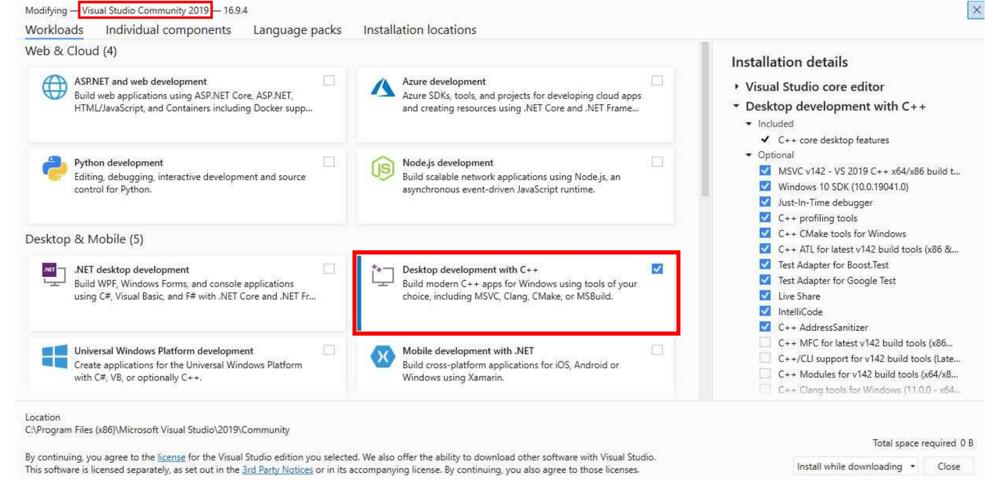
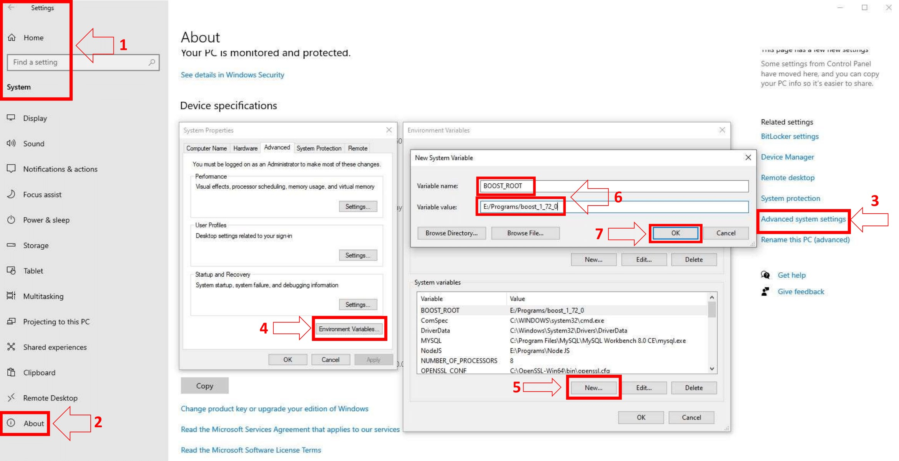

# Windows 要求

||
|--|
|Boost ≥ 1.78|
|MySQL ≥ 5.7.0|
|OpenSSL ≥ 1.0.x|
|CMake ≥ 3.16|
|MS Visual Studio (Community) ≥ 17 (2022)（桌面版）（非预览）|

1. [Git](https://git-scm.com/download/win)
    1. 下载独立安装程序
        - 在 Git 安装过程中 —— 调整 PATH 环境。选择 "Git from the command line and also from 3rd-party software"。

2. Github 桌面
    1. 下载安装程序并按步骤进行设置。

3. 安装编译器/集成开发环境 [Visual Studio (17) Community 2022](https://visualstudio.microsoft.com/downloads/)

    你需要安装 C++ 编译器。

    为此，请在 **Workloads** -> **Desktop & Mobile** 下选择 **Desktop development for C++**。

4. [MySQL 服务器社区版](https://dev.mysql.com/downloads/mysql/8.0.html)（使用版本 ≥ 5.7 的 mysql 服务器配置）

    1. 下载 Windows MSI 安装程序。
    2. 向下滚动到底部并单击 "不，谢谢，请带我去下载！（No thanks, just take me to the downloads!）"
    3. 安装基本完成后，确保选中 "启动 MySQL 实例配置向导（Launch the MySQL Instance Configuration Wizard）"，然后单击 "完成（Finish）"。
    4. 当 MySQL 实例配置向导启动时，大多数默认选项都没问题，但请记住您使用的用户名和密码（root / / 随便什么）。您需要用它们登录所选的数据库管理工具（如下），以便稍后导入 SQL 文件。
    5. 要测试 MySQL 设置是否正确，按键盘上的 `CTRL+ALT+DEL`，进入任务管理器，选择 "服务 "选项卡。在服务列表中应看到状态为 "运行中 "的 "MySQL"。
    6. 将 MySQL 添加到环境变量。
        1. 进入控制面板 -> 系统
        2. 转到高级系统设置
        3. 转到环境变量
        4. 在 "系统变量 "下选择路径
        5. 编辑并添加 MySQL 的安装路径，即 `C:\Program Files\MySQL\MySQL Server 8.0\bin\`

5. 选择数据库管理工具
    1. mysql cli（最快）
    2. [SQLYog 社区版](https://github.com/webyog/sqlyog-community/wiki/Downloads)
    3. HeidiSQL（最适合初学者）
    4. MySQL Workbench（如果选择安装完整 MySQL 软件包，则已安装）
    5. [DBeaver](https://dbeaver.io/)（多平台数据库管理工具）
        1. 尝试连接数据库。您可能要查找 "连接到主机（Connect to Host）"或 "新建连接（New Connection）"或 "会话管理器（Session Manager）"，这取决于你使用的程序。
        2. 创建新连接/会话。如果在安装 HeidiSQL 或 SQLYog 的同一台计算机上安装了 MySQL，则主机名/IP 地址为 "127.0.0.1 "或 "localhost "即可。只需填写 root （不用管密码），现在就可以连接到数据库了。

6. [CMake](https://cmake.org/)
    1. 下载并安装**最新发布**的 win32-x86.exe 文件，**不要使用 RC（候选发布）版本**。
    2. 我们建议在 64 位模式下编译。

7. MySQL 开发文件
    1. 这些文件随 MySQL Server 一起提供，请在 program files 目录下的 `MySQL\MySQL Server 8.0\lib` 或 `MySQL\MySQL Server 5.7\lib` 查找。

8. [OpenSSL](http://www.slproweb.com/products/Win32OpenSSL.html) 下载 64 位版本。如果你打算同时编译 32 位和 64 位版本，也可以同时下载这两个版本，它们可以并存。
    - 通过查找最新的 3.0.x Win64 OpenSSL（**非** "精简（light）"版）来查找 64 位版本。(例如：Win64 OpenSSL v3.0.7）
    - 通过查找最新的 3.0.x Win32 OpenSSL（**非** "精简（light）"版）来查找 32 位版本。(例如：Win32 OpenSSL v3.0.7）
    - *注意 #1：如果在安装 OpenSSL 时收到 "Missing Microsoft Visual C++ ....Redistributable" 错误信息，请下载 [Microsoft Visual C++ 2017/2019/2022 Redistributable Package (x64)（直接下载）](https://aka.ms/vs/17/release/vc_redist.x64.exe) (1.7MB Installer) 并安装。如果需要 32 位支持，请下载并安装 [Microsoft Visual C++ 2017/2019/2022 Redistributable Package (x86)（直接下载）](https://aka.ms/vs/17/release/vc_redist.x86.exe)*。
    - *注意 #2：安装 OpenSSL 时，在选择复制 OpenSSL DLL 的位置时，请选择 OpenSSL 二进制文件 (/bin) 目录（而不是 "Windows 系统目录"）。[核心安装](/core-installation/windows-core-installation)时需要轻松找到这些 DLL*。

9. [boost](https://www.boost.org/)
    1. 下载 Visual Studio 2022 预编译的 Windows 二进制程序
    2. [64 位](https://sourceforge.net/projects/boost/files/boost-binaries/1.81.0/boost_1_81_0-msvc-14.3-64.exe/download)
    3. [32 位](https://sourceforge.net/projects/boost/files/boost-binaries/1.81.0/boost_1_81_0-msvc-14.3-32.exe/download)
    4. 在 "系统（System）"变量中添加一个名为 "BOOST_ROOT "的环境变量，并将 Boost 安装目录作为变量值，例如 `C:/local/boost_1_81_0`。重要的是，指向目录时要使用"**/**"，而不是"**\**"。(确保没有斜线（路径末尾）。如果仍有问题，请在 `USER` 变量部分也添加相同的变量，如下图所示）。

    

    1. 请注意，该图片显示的版本号为 `1.72.0`，请在设置中使用实际版本号。

## 帮助
---

如果仍有问题，请查看：

- [常见问题](/faq)
- [常见错误](/common-errors)
- [如何寻求帮助](/how-to-ask-for-help)
- [加入我们的 Discord 服务器](https://discord.gg/gkt4y2x)，但这不是一个全天候支持频道。只要有时间，工作人员就会回答您的问题。

> [英文链接](https://www.azerothcore.org/wiki/windows-requirements)
